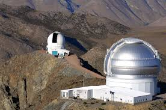

  
 # CS 539: Machine Learning - Project
 # Team “Stars”
 # Yao-Chun Hsieh, Manasee Godsay, Nathan Hsu, Wei Zhao
 

 Project Details:
 Name: PLAsTiCC Astronomical Classification
 Data set: Kaggle dataset - Link: https://www.kaggle.com/c/PLAsTiCC-2018 

 
https://www.lsst.org/

 The Photometric LSST Astronomical Time Series Classification Challenge (PLAsTiCC) is a Kaggle problem. The problem is to classify simulated astronomical time-series data in preparation for observations from the Large Synoptic Survey Telescope (LSST). LSST is the Telescope and the data collected from it will give a deep understanding of the changing sky, discovering and measuring millions of time-varying objects.

 Two important modes for characterizing light from astronomical objects are called ‘spectroscopy’ and ‘photometry.’ We will be considering ‘photometry’.

 Some Domain knowledge:
 Spectroscopy is the most accurate reliable tool for classification of astronomical transients and variables, however, it’s extremely time-consuming process. Given the volume of the data expected from the upcoming large-scale sky surveys, obtaining spectroscopic observations for every object is not feasible. 
Compared with spectroscopy, the advantage of photometry(measuring light curves with passband observations) is that we can observe objects that are much further away and much fainter, and that one can observe many objects in a larger field of view at the same time(rather than measuring a spectrum of one or a few objects at a time), which means it’s less time-consuming and more feasible.

 Objective: 
 Our main task is to classify the “stars” in 14 classes using photometry data, so we don’t need expensive spectroscopy data. We will try to calculate the probabilities for each classes, so we can decide which one the object should belong to.
 The benefitters would be the astronomers, and would help them gain a deeper understanding of the objects in the Universe, being monitored by LSST with low cost.

 Existing tools/platforms:
 Currently similar tool does not exist. 

 Challenges: 
 The main challenges are the amount of the data and the unknown patterns in the data, trying to use just light curves instead of use both light curves and spectrograph to classify the stars/objects. Each class may have different pattern through time, or have different cycle of light, it will be hard to identify the proper length of time duration we need.

 Methodology, algorithms:
 The repository mainly separates data in two parts:
 Metadata: constant properties of different classes of star.
 Time series data: changes of lumen in multiple passbands across time (future scope)
  

 

 Data description: 
   
 Metadata
 ddf: A flag to identify the object as coming from the DDF survey area (with value DDF = 1 for the DDF, DDF = 0 for the WFD survey). 
 hostgal_specz: the spectroscopic redshift of the source. 
 mwebv: MW E(B-V). This ‘extinction’ of light is a property of the Milky Way (MW) dust along the line of sight to the astronomical source, and is thus a function of the sky coordinates of the source ra, decl. 
 target: The class of the astronomical source.
  
 

  
 

 Data description: 
  
 Time-Series data (for training model)
 object_id: Foreign key with the metadata for identifying each object. 
 mjd: the time in Modified Julian Date (MJD) of the observation. 
 passband: The specific LSST passband integer, such that u, g, r, i, z, Y = 0, 1, 2, 3, 4, 5 in which it was viewed. 
 flux: the measured flux (brightness) in the passband of observation as listed in the passband column. 
 flux_err: the uncertainty on the measurement of the flux listed above. 
 detected: If 1, the object's brightness is significantly different at the 3-sigma level relative to the reference template.   

  We tried both Binary and Mutli- classification for the data with the given algorithms.
 The core algorithms we used for the classification problem are: 
   
 Decision trees
  
 Logistic Regression 
  
Random Forest 
   
SVM
   
Gradient Boosting

Code files:
 
- 1. Data: training_set.csv.zip, training_set_metadata
 
- 2. Stars - Split_Train_Validation.ipynb : Splitting data into training and testing set
 
- 3. binary_classification.ipynb : Pre-processing and models for Binary classification
 
Binary classification: Logistic Regression, Decision Tree, Random Forest, Gradient boosting, SVM
 
- 4. Stars-Exploratory Data Analysis.ipynb: Exploratory Data Analysis for Multi-classification
 
- 5. Stars- Data Engineering and Multi-Classifier Model Building.ipynb : Data Engineering and Models for multi-classification
 
Feature Extraction with Statistical Methods 
 
Feature Extraction with customized function
 
Feature Normalization with MinMaxScaler 
 
Feature Transformation with LDA
 
Multiple classification: 
- Logistic Regression,
- Random Forest,
- Gradient boosting,
- SVM
 

Existing resources: 
 
Paper for some domain knowledge, astronomy concepts: The Photometric LSST Astronomical Time-series Classification 
Challenge: https://arxiv.org/abs/1810.00001 
 
The PLAsTiCC Astronomy "Starter Kit": https://www.kaggle.com/michaelapers/the-plasticc-astronomy-starter-kit

 Demonstration of the usefulness of tool: 
  
 Confusion matrix with accuracy, precision and recall will be used for performance evaluation.
  

 

Refer to Final Project Presentation.ppt.
